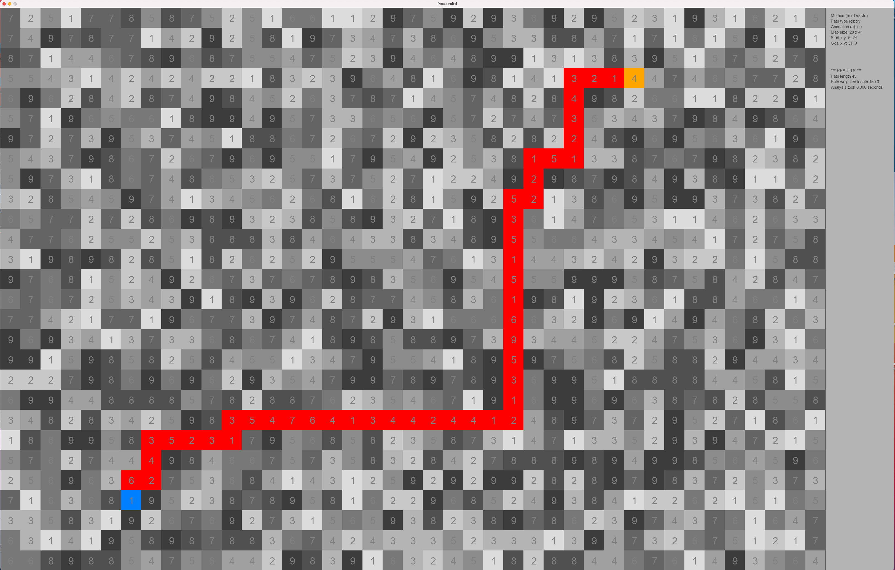

# Data Structures Laboratory 

# Grid Map Navigator

The application is a grid map navigator, which finds the best route between two grid nodes.  Every grid node on the map has a value (1-9) representing the cost or time increment added when the route is passing the node.

Route finding can be tested with different algorithms; Dijkstra, A*, IDA* and Jump Point Search.

The route can pass from one grid node to its neighbour nodes either orthogonally or both orthogonally and diagonally.

The program is written in Python.

## Documentation

[Definition](https://github.com/lautanal/datastructures_lab/blob/master/documentation/definition.md)

[Implementation ](https://github.com/lautanal/datastructures_lab/blob/master/documentation/implementation.md)

[User Manual](https://github.com/lautanal/datastructures_lab/blob/master/documentation/manual.md)

## Releases

[Final](https://github.com/lautanal/datastructures_lab/releases/tag/final)

