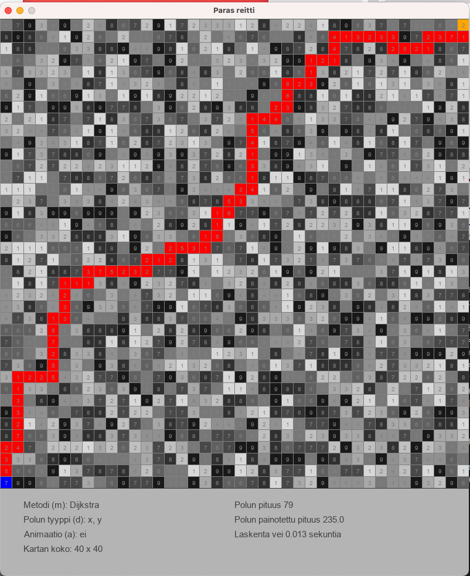

## Definition

The application is a grid map navigator, which finds the best route between two grid nodes.  Every grid node on the map has a value (1-9) representing the cost or time increment added when the route is passing the node.

Route finding can be tested with different algorithms; Dijkstra, A*, IDA* and Jump Point Search.

The route can pass from one grid node to its neighbour nodes either orthogonally or both orthogonally and diagonally.

## Programming language

The program is written in Python (version 3.8.8).  Visualisation and user interface are written using Pygame-library.

## Algorithms and data structures

Route finding is tested with Dijkstra, A*, IDA* ja Jump Point Search algorithms.

## Program inputs

The program generates a grid map or the user can load a map from file.

The user selects start and end points, route finding algorithm and other parameters.

The program shows the calculated route visually.  Path finding can be animated.

## Time and space complexity

Time complexity: O((V + E log V)

Space complexity: O(V)

## Sources

[Dijkstra Wikipedia](https://en.wikipedia.org/wiki/Dijkstra%27s_algorithm)

[A* Wikipedia](https://en.wikipedia.org/wiki/A*_search_algorithm)

[IDA* Wikipedia](https://en.wikipedia.org/wiki/Iterative_deepening_A*)

[JPS Wikipedia](https://en.wikipedia.org/wiki/Jump_point_search)
