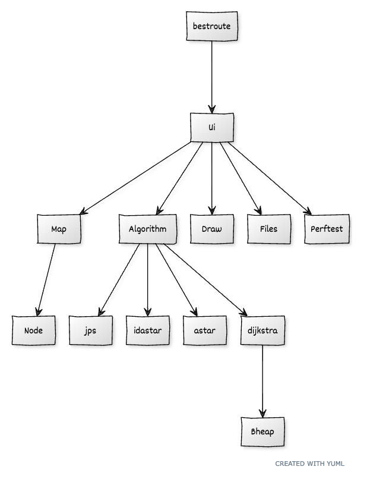

# Implementation

## Program Structure

The program is written in Python version 3.8.8. using object-oriented methods.  

General structure of the code is:

- The main program bestroute.py starts the user interface defined in Ui class
- The Ui class creates a graphical user interface using the Pygame library
- The Ui class creates an instance of Map class, that models a grid map
- The Map class creates Node class objects, that model grid map nodes
- The Ui class creates an Algorithm class object, that makes the route claculations
- The Algorithm class calls the selected algorithm (Dijkstra, A*, IDA* tai JPS)
- Dijkstra algorithm uses a binary heap which is defined in the Bheap class
- Pygame drawing routines are defined in the Draw class
- File input and output functions are defined in Files class
- Performance tests are defined in the Perftest class

## Used algorithms and data structures

### Dijkstra
Dijkstra algorithm stores the nodes in a binary heap.  The program takes always the node from the heap that has a minimum distance from start node.  The binary heap is constructed in the Bheap class.

### A*
A* -method is like Dijkstra method with heuristics that forecast the distance to the goal.  A* method uses the Pythonin standard library heapq-module.

### IDA*
IDA* method adds depth search to A* algorithm.  IDA* method uses the Pythonin standard library heapq-module.

### Jump Point Search
JPS can be used when the grid is weightless and diagonal paths are allowed between nodes.

## Performance tests

Performance tests are accomplished with different map sizes.  The best route is calculated with different methods. 

### Weighted maps

All nodes have a weight that represent a cost or time increment when route passes the node.  The route can pass between nodes only orthogonally.

Grid size | Nodes | Edges | V + E log V | Algorithm | Average runtime (10 maps)|
--------|--------|--------|--------|-------------|-------------|
| 100 x 100 | 10000 | 19800 | 273097 | Dijkstra | 0.0896 |
| | | | | A\* | 0.0367 |
| | | | | IDA\* | 0.5331 |
| 200 x 200 | 40000 | 79600 | 1256902 | Dijkstra | 0.3970 |
| | | | | A\*     | 0.1560 |
| | | | | IDA\*   | 3.9088 |
| 300 x 300 | 90000 | 179400 | 2042500 | Dijkstra | 0.9518 |
| | | | | A\*     | 0.3692 |
| | | | | IDA\*   | 13.3590 |
| 400 x 400 | 160000 | 319200 | 5678238 | Dijkstra | 1.7554 |
| | | | | A\*      | 0.6370 |
| | | | | IDA\*    | 29.5708 |
| 500 x 500 | 250000 | 499000 | 9197853 | Dijkstra | 2.8174  |
| | | | | A\*     | 1.0455  |
| | | | | IDA\*   | 56.3359 |

### Wehtless grid maps

All nodes are equal and route can pass diagonally between nodes.

Grid size | Nodes | Edges | V + E log V | Algorithm | Average runtime (10 maps)|
--------|--------|--------|--------|-------------|-------------|
| 100 x 100 | 10000 | 39402 | 533562 | Dijkstra | 0.1218 |
| | | | | A\* | 0.0508 |
| | | | | IDA\* | 0.5023 |
| | | | | JPS | 0.0357 |
| 200 x 200 | 40000 | 158802 | 2467719 | Dijkstra | 0.5343 |
| | | | | A\*     | 0.2319 |
| | | | | IDA\*   | 5.5076 |
| | | | | JPS | 0.2637 |
| 300 x 300 | 90000 | 358202 | 5985159 | Dijkstra | 1.2569 |
| | | | | A\*     | 0.5283 |
| | | | | IDA\*   | 18.9459 |
| | | | | JPS | 0.7785 |
| 400 x 400 | 160000 | 637602 | 11182680 | Dijkstra | 2.3001 |
| | | | | A\*      | 0.9362 |
| | | | | IDA\*    | 51.8285 |
| | | | | JPS | 1.6054 |
| 500 x 500 | 250000 | 997002 | 18127810 | Dijkstra | 3.6767  |
| | | | | A\*     | 1.4412  |
| | | | | IDA\*   | 109.4129 |
| | | | | JPS | 2.6955 |

### Time complexity

The measured Dijkstra, A\*- ja JPS time complexities are in accordance with the theoretical O(V + E logV) time complexity.

A\* method is almost allways the best route finding algorithm.  Dijkstra method works also well, but IDA\* is not at its best with this kind of grid maps.  JPS method works well when it can be used (weightless grid maps).

## Defects and improvements

JPS-method can not be used in a weighted grid map.  JPS-method accepts a diagonal route between  nodes.

IDA*-algorithm is not very well suited for weighted grid maps.

Pygame library is sometimes very slow.

