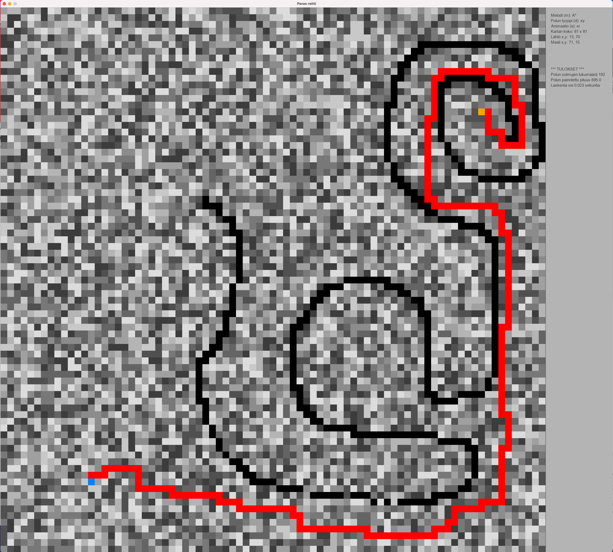

# User manual

## Download

Download release [release](https://github.com/lautanal/tiralabra/releases/tag/Final).

## Installation

The program is copied to a user defined folder.

A virtual environment is created:

$ poetry install

## Program running

The program is run in the installation folder using the following command:

$ poetry run python3 src/bestroute.py

## User interface

The program is run and controlled through a user interface :

Käyttäjä valitsee lähtö- ja maaliruudun hiiren vasemmalla näppäimellä.  Kun lähtö ja maali on valittu, hiiren vasemmalla näppäimellä voi asettaa esteet, joiden läpi reitti ei voi kulkea.
Lähdön ja maalin sekä esteet voi poistaa hiiren oikealla näppäimellä.

The algorithm is chosen with keyboard command m.

Route finding starts with keyboard command s.

## Commands

### Keyboard commands:

s : start, start calculating the best route

c : clear, clear start and end points

r : reset, erase the calculated route

m : method, Dijkstra / A* / IDA* / JPS

d : diagonal, orthogonal or diagonal toggle

a : animointi, animation on/off toggle

n: new, generates a new random map (weighted nodes)

g: generate, generates anew map without weights (all nodes equal)

t : test, program test 10 random maps (koko 100 x 100)

\+ : increase node count 10% in both directions and generate a new map

\- : decrease node count 10% in both directions and generate a new map

1 : load map 1.map (from folder data/maps)

2 : load map 2.map (from folder data/maps)

w : write, save map into file f.map (folder data/maps)

f : file, load map from file f.map (folder data/maps)

### Mouse commands:

Left click chooses the start point (if it does not exist)

Left click chooses the end point (when start point is chosen and end point does not exist)

Left click chooses the a blocked node (when start point and end point are already chosen)

Right click erases a node (start point, emnd point or a blocked node)

In edit mode left click increases the node cost, right click decreases the node cost

